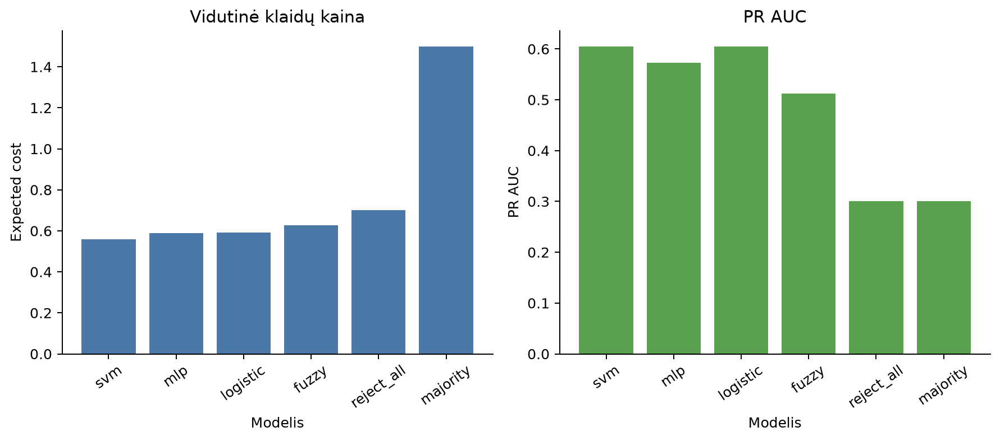

# Kredito paraiškų rizikos klasifikavimas

Karolis Lapinskas · PEPfm-26 · Intelektualiosios sistemos

Projektas palygina logistinę regresiją, SVM, MLP, fuzzy ir dvi pastovias atskaitos taisykles. Duomenys: OpenML `credit-g`, 1 000 įrašų ir 20 požymių. Pasirinktas **SVM**, pasiekęs mažiausią vidutinę klaidų kainą (0,558). Galutiniame teste aptikta 95 % `bad` atvejų, tačiau atmesta 64,3 % `good` atvejų. Kaina `C=(FP+5×FN)/n` yra demonstracinė prielaida.

- [Word ataskaita](docs/Karolis_Lapinskas_Galutinio_darbo_ataskaita.docx) – metodai, formulės ir rezultatų paaiškinimas.
- [Modelių palyginimas](results/final/model_summary.csv) ir [testo metrikos](results/final/final_test_metrics.json).
- `results/final/index.html` – rezultatų peržiūra naršyklėje, atsisiuntus projektą.



## Paleidimas savo kompiuteryje

Reikia Python 3.12. Projekto aplanke, Windows PowerShell:

```powershell
py -3.12 -m venv .venv
.\.venv\Scripts\python.exe -m pip install -r requirements.txt
.\.venv\Scripts\python.exe -m src.main --config config/experiment.yaml
Start-Process results/final/index.html
```

Pirmą kartą reikia interneto duomenims gauti. Komanda sukuria modelį, lenteles, grafikus ir HTML peržiūrą. Trumpesniam bandymui pridėkite `--quick`; jo rezultatai bus `results/quick/`. Ataskaitoje pateikti pilno eksperimento rezultatai.

Po pilno eksperimento galima prognozuoti du pavyzdinius įrašus ir patikrinti testus:

```powershell
.\.venv\Scripts\python.exe -m src.predict --input examples/applications.csv
.\.venv\Scripts\python.exe -m pytest -q
```

Prognozė pateikia `bad_probability`, sprendimo slenkstį ir klasę. CSV turi turėti visus 20 pavyzdžio stulpelių. Pavyzdiniai įrašai sintetiniai. Linux/macOS aplinkoje naudokite `python3 -m venv .venv`, o vykdymui – `.venv/bin/python`.

## Paleidimas GitHub

1. Atverkite **Actions → Tests and experiment**.
2. Spauskite **Run workflow**, pasirinkite `main` ir dar kartą **Run workflow**.
3. Atverkite naują paleidimą. Žalia varnelė rodo, kad testai, trumpas eksperimentas ir pavyzdžių prognozavimas baigėsi sėkmingai.
4. Skiltyje **Artifacts** atsisiųskite `rezultatai`, išskleiskite ZIP ir atverkite `index.html`. Prognozės yra `predictions.csv`.

Įprastas kodo įkėlimas paleidžia tik testus. Rankinis paleidimas papildomai vykdo trumpą eksperimentą, todėl jo skaičiai gali skirtis nuo ataskaitos. Rezultatų paketas saugomas 7 dienas.

## Projekto struktūra

`src/` – kodas; `config/` – nustatymai; `tests/` – 11 testų; `examples/` – įvestis; `docs/` – ataskaita; `results/final/` – pagrindiniai pilno bandymo rezultatai. Papildomos diagnostikos lentelės sukuriamos paleidus programą ir pateikiamos HTML peržiūroje. `run_manifest.json` saugo versijas bei nustatymus, `outer_fold_results.csv` – visus CV rezultatus. Stulpelis `pr_auc` reiškia AP (`average_precision_score`).

## Trumpas AI naudojimo įrašas

AI naudotas projekto kodui ir ataskaitai rengti bei tikrinti. Užduotys: palyginti metodus, paleisti eksperimentą, paaiškinti rezultatus. Priimti pasiūlymai dėl vienodo vertinimo, CSV prognozavimo ir rezultatų peržiūros. Atmestas teiginys apie statistiškai įrodytą SVM pranašumą.

Patikrinti ir pataisyti du trūkumai: (1) SVM paruošimas perkeltas į kalibravimo vidinius skaidymus – patikrinta testu ir pilnu paleidimu; (2) vien daugumos klasės atskaita buvo nepakankama – pridėta visada `bad` taisyklė ir patikrinta jos 0,7 kaina. Rezultatai sutikrinti su sugeneruotomis lentelėmis.
