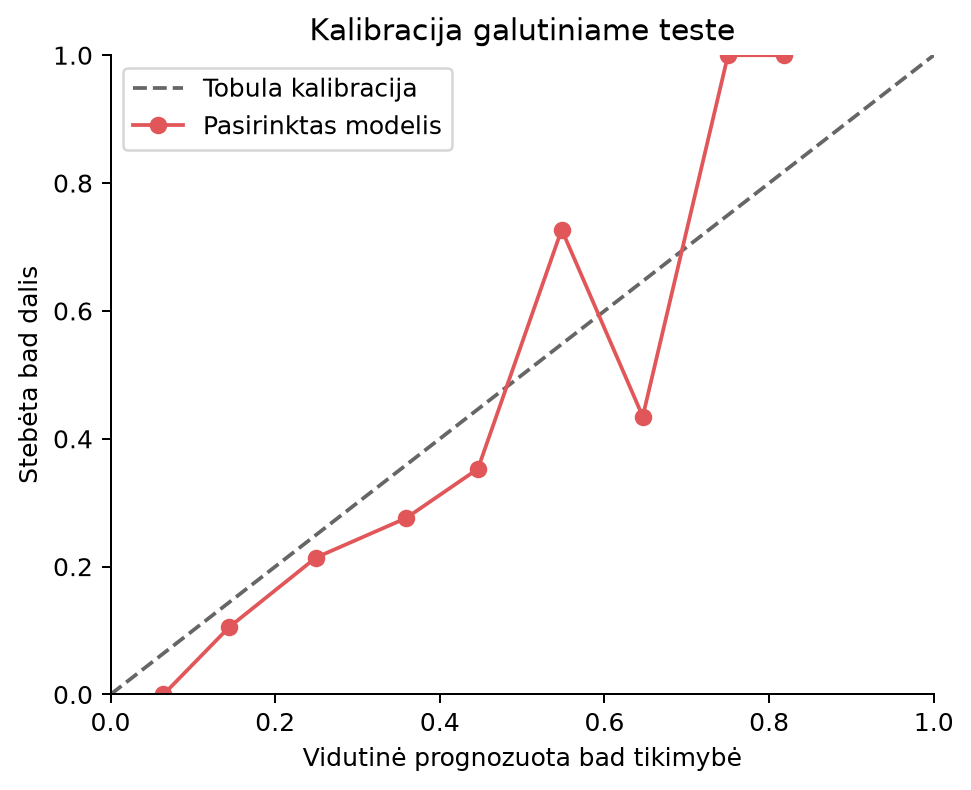

# Kredito paraiškų rizikos klasifikavimas

Karolis Lapinskas · PEPfm-26 · Intelektualiosios sistemos

Galutinio egzamino darbas · 2026 m. rugsėjo 20 d.

## Santrauka

Sukurtas ir paleistas kredito rizikos klasifikavimo prototipas. Viešame OpenML credit-g rinkinyje palyginti du paprasti atskaitos metodai, logistinė regresija ir trys intelektualieji metodai: SVM, MLP bei fuzzy tipo taisyklių sistema. Modelis pasirinktas pagal kartotinio stratifikacinio kryžminio vertinimo klaidų kainą, nenaudojant galutinio testo. Mažiausią vidutinę kainą pasiekė SVM: 0,558, kai klaidingos blogos rizikos patvirtinimo ir geros rizikos atmetimo kainų santykis yra 5:1. Galutinio testo kaina yra 0,525, tačiau modelis atmeta daug geros rizikos atvejų. Todėl rezultatas patvirtina prototipo veikimą ir parodo pasirinkto slenksčio kompromisą, bet nepakanka realiai kreditavimo sistemai patvirtinti.

## 1 Problema ir jos išskaidymas

### 1.1 Problemos supratimas

Techninis uždavinys yra iš 20 paraiškos požymių įvertinti blogos kredito rizikos tikimybę ir pagal pasirinktą slenkstį priskirti klasę. Praktinis poreikis yra palyginti nevienodas dviejų klaidų pasekmes: geros rizikos atmetimą FP ir blogos rizikos patvirtinimą FN. Didelis bendras tikslumas savaime neparodo, ar sprendimas naudingas: daugumos klasės taisyklė teisingai klasifikuoja 70 % atvejų, bet neaptinka nė vieno blogos rizikos atvejo.

Neakivaizdžios problemos dalys yra šios. Pirma, 1 000 istorinių įrašų nepakanka patikimai vertinti visų gyventojų grupių; vienas atsitiktinis skaidymas gali pakeisti metodų eilę. Antra, kategoriniai ir skaitiniai požymiai turi skirtingą prasmę, todėl kategorijų negalima tiesiog laikyti didėjančiais skaičiais. Trečia, nėra žinomi tikri banko nuostoliai, todėl 5:1 yra eksperimento sąlyga, o ne įrodyta veiklos politika. Ketvirta, SVM sprendimo balas nėra tikimybė, todėl būtina kalibracija. Penkta, daugiau netiesiškumo gali padėti aptikti požymių sąveikas, bet kartu padidina persimokymo ir sudėtingumo riziką. Šešta, amžius bei asmeninė būsena gali padėti klasifikuoti istorinius duomenis, tačiau jų naudojimas kelia grupių skirtumų ir tinkamumo klausimų.

Kiekviena iš šių vietų turi konkretų sprendimą: kartotinis vertinimas, transformacijų grandinė mokymo dalyje, aiški kaštų matrica, atskira kalibracija, kelių metodų palyginimas ir požymių abliacija. Lieka neapibrėžtumas dėl duomenų pasenimo, realių nuostolių ir perkėlimo į kitą populiaciją. Šiame darbe jie nėra eksperimentiškai išspręsti.

Komercinis FICO pavyzdys rodo papildomą poreikį: klientui pateikiami balui įtaką darantys priežasčių kodai [6]. Tai padeda išspręsti komunikavimo neaiškumą, kai vienas skaičius nepaaiškina sprendimo. Viešas aprašymas neatskleidžia viso modelio ir neįrodo, kad jis pašalina grupių skirtumus. Šio prototipo klaidų pavyzdžiai yra diagnostika, o ne individualus priežasčių kodų mechanizmas.

### 1.2 Sprendimo etapai

| Etapas | Konkretus uždavinys | Patikrinamas rezultatas |
|---|---|---|
| Duomenų gavimas | Gauti ID 31, patikrinti 20 požymių ir klases | Šaltinio manifestas ir SHA-256 |
| Paruošimas | Užpildyti trūkstamas reikšmes, koduoti kategorijas ir standartizuoti skaičius | Išmokta transformacijų grandinė |
| Modeliavimas | Vienodomis sąlygomis palyginti alternatyvas | 90 išorinių CV rezultatų eilučių |
| Sprendimo taisyklė | Parinkti slenkstį pagal 5:1 kainą | Slenkstis, parinktas plėtros dalyje |
| Patikra | Įvertinti testą, abliaciją, atsparumą ir grupes | CSV metrikos, grafikai ir klaidų pavyzdžiai |
| Naudojimas | Priimti naują CSV ir pateikti prognozes | Paleidžiama prognozavimo komanda |

Etapams reikia duomenų inžinerijos, statistinio modeliavimo, programavimo ir dalykinio rizikos vertinimo kompetencijų. Atskiros kompetencijos nepakeičia bendro vertinimo kriterijaus: kiekvienas etapas turi prisidėti prie patikrinamo sprendimo.

### 1.3 Uždavinių prasmė skirtingų sričių specialistams

Duomenų patikros uždavinys reiškia, kad sprendimai turi remtis palyginama ir taisyklinga informacija. Projekto vadovas pagal tai gali nustatyti, ar sistema jau parengta bandymui, o vadybininkas supranta, kodėl netaisyklingos paraiškos negalima tyliai vertinti. Modelių palyginimo uždavinys reiškia, kad sudėtingesnis sprendimas turi pateisinti papildomas sąnaudas. Finansininkui svarbus klaidų santykis, nes gerų klientų praradimas ir blogų paskolų rizika skirtingai veikia veiklos rezultatą.

Slenksčio parinkimo uždavinys atskiria rizikos vertinimą nuo sprendimo politikos: tas pats modelis gali pateikti tą pačią tikimybę, bet kitokia klaidų kaina lemia kitą klasę. Personalo vadybininkui bei darbuotojų mokymą planuojančiam vadovui svarbu, kad naudotojai mokėtų interpretuoti šį skirtumą ir ribinius atvejus perduoti peržiūrai. Grupių patikra leidžia aptarti, ar sistemos klaidos skirtingus pareiškėjus paliečia nevienodai; ji nepaverčiama automatiniu leidimu naudoti sistemą.

## 2 Alternatyvos ir literatūros pagrindimas

Intelektualieji metodai taikomi rizikos klasifikavimui. Atsisiuntimas ir CSV tikrinimas yra deterministiniai programavimo uždaviniai, kuriems intelektualiosios sistemos nereikia. Palyginamos keturios modeliavimo alternatyvos, iš kurių logistinė regresija kartu yra užduotyje reikalaujamas paprastas atskaitos modelis.

| Metodas | Kodėl tinka šiam uždaviniui | Pagrindinis ribojimas |
|---|---|---|
| Logistinė regresija | Dvejetainė klasė, nedidelė lentelinė imtis, paprasta reguliuojama riba | Netiesines sąveikas reikia įvesti papildomai |
| RBF SVM | Galimos netiesinės sumos, trukmės ir kitų požymių sąveikos | Reikia standartizavimo, parametrų parinkimo ir kalibracijos |
| MLP | Gali išmokti kelių požymių netiesines sąveikas | Maža imtis, atsitiktinumo ir persimokymo rizika |
| Fuzzy tipo sistema | Narystės laipsniai leidžia palaipsniui išreikšti didelę sumą ir ilgą trukmę | Rankiniai svoriai nėra patvirtinti ekspertų ar išmokti iš duomenų |

Lessmann ir kt. (2015) lygino kredito rizikos klasifikavimo algoritmus, įskaitant German Credit duomenis [1]. Šaltinis tiesiogiai pagrindžia poreikį vertinti alternatyvas tame pačiame dalykiniame uždavinyje ir naudoti logistinę regresiją kaip atskaitą; jis neįrodo, kad vienas metodas laimės šiame skaidyme.

Cortes ir Vapnik (1995) aprašo atraminių vektorių klasifikavimą [2]. SVM tinkamumo argumentas šiame darbe yra galimybė reguliuoti klasifikavimo ribą ir naudoti branduolį, kai paprastas tiesinis požymių derinys nepakankamas. MLP motyvuoja neuroninių tinklų gebėjimas aproksimuoti sudėtingas funkcijas; Cybenko (1989) pateikia teorinį sigmoidinių tinklų rezultatą [3]. Tai nėra garantija, kad šio projekto ReLU MLP gerai mokysis iš 800 įrašų; jo tinkamumas sprendžiamas eksperimentu.

Zadeh (1965) pagrindžia fuzzy aibių narystės laipsnio sąvoką [4]. Ji tinka palaipsniui augančiai rizikos taisyklei išreikšti. Šaltinis nepagrindžia konkrečių šiame kode parinktų svorių. Naudojama supaprastinta svertinių narystės funkcijų sistema, o ne pilna Mamdani ar Sugeno ekspertinė sistema. Todėl SVM ir MLP yra du pagrindiniai įgyvendinti intelektualieji mokomi metodai, o fuzzy yra papildomas aiškinamas palyginimas.

Papildomai įtrauktos pastovios taisyklės: visada prognozuoti good ir visada prognozuoti bad. Antroji taisyklė svarbi kaštams jautriam vertinimui: esant 30 % bad daliai ir 5:1 kainai jos kaina 0,7, o daugumos taisyklės kaina 1,5. Naudingas modelis turi būti lyginamas ir su šia pigia alternatyva.

## 3 Eksperimentas ir sprendimo pasirinkimas

### 3.1 Vertinimo protokolas ir pasirinkimo kriterijus

Duomenys stratifikuotai padalyti į 800 plėtros ir 200 testo įrašų; sėkla 2026. Plėtros dalyje visiems šešiems metodams naudojami tie patys 5 dalių ir 3 kartojimų išoriniai skaidymai. Kiekvieno mokomo modelio parametrai parenkami vidiniu 3 dalių vertinimu, bandant 5 atsitiktinai parinktus derinius ir maksimizuojant average precision. Parametrų erdvės pateiktos src/models.py funkcijoje parameter_space. Trūkstamų reikšmių užpildymas ir kodavimas apmokomi mokymo dalyje. SVM atveju visa transformacijų grandinė yra kalibratoriaus viduje, todėl ji iš naujo mokoma ir kalibravimo skaidymuose [7].

Slenkstis parenkamas iš mokymo dalies out-of-fold prognozių, minimizuojant vidutinę klaidų kainą. Parametrų paieškai ir slenksčio parinkimui naudojami tie patys vidinio CV skaidymai, todėl vidinės slenksčio kainos negalima laikyti nepriklausomu kokybės įverčiu. Kokybei naudojama išorinė validavimo dalis. Galutinis testas nenaudojamas nei parametrams, nei slenksčiui, nei modelio šeimai parinkti.

Pagrindinė hipotezė: RBF SVM pasieks mažesnę vidutinę kainą nei logistinė regresija ir pastovios taisyklės. Pasirinkimo taisyklė nustatyta kode: laimi mažiausia išorinių CV kainų vidutinė reikšmė. Tai optimalumas tarp išbandytų variantų pagal konkretų kriterijų, o ne visų galimų algoritmų globalus optimumas. Visa programa sukuria 15 × 6 = 90 rezultatų eilučių. Vien parametrų paieška trims mokomiems metodams išoriniuose skaidymuose apima 15 × 3 × 5 × 3 = 675 kandidatų įvertinimus; SVM vidinė kalibracija reikalauja papildomų mokymų. MLP iteracijų riba 400, įjungtas ankstyvas stabdymas.

### 3.2 Rezultatai ir pasirinkto metodo privalumai

Lentelėje pateikti 15 išorinių skaidymų vidurkiai; kainai papildomai pateiktas standartinis nuokrypis.

| Metodas | Balanced accuracy | AP | Brier | Kaina ir SD |
|---|---|---|---|---|
| SVM | 0,665 | 0,605 | 0,170 | 0,558 ± 0,062 |
| MLP | 0,635 | 0,572 | 0,179 | 0,590 ± 0,059 |
| Logistinė regresija | 0,661 | 0,605 | 0,178 | 0,592 ± 0,078 |
| Fuzzy | 0,595 | 0,512 | 0,250 | 0,628 ± 0,074 |
| Visada bad | 0,500 | 0,300 | 0,700 | 0,700 ± 0,000 |
| Visada good | 0,500 | 0,300 | 0,300 | 1,500 ± 0,000 |

Pasirinktas SVM. Jo kaina už logistinės regresijos mažesnė 0,034 sąlyginio vieneto vienai paraiškai, arba apie 5,8 %. Pranašumas prieš MLP yra 0,032, prieš fuzzy 0,070, prieš visada bad 0,142. SVM taip pat turi mažiausią Brier balą ir didžiausią balanced accuracy vidurkį. AP reikšmės SVM ir logistinės regresijos beveik sutampa; pagal šį kriterijų SVM pranašumo nėra. Rezultatų SD nėra pasikliautinasis intervalas, o persidengiantys kartotinio CV mokymo rinkiniai nėra nepriklausomos imtys. Statistinis skirtumo reikšmingumas netirtas, todėl teigiama tik apie stebėtą šio eksperimento kainos minimumą.

SVM išskirtinis privalumas prieš logistinę regresiją yra netiesinė RBF riba be rankinio visų sąveikų konstravimo. Prieš rankinį fuzzy modelį jis turi duomenimis išmokstamą ribą ir šiame bandyme geresnį tikimybių įvertinimą. Prieš MLP šioje mažoje imtyje jis pasiekė mažesnę kainą bei Brier balą, nors abiejų modelių parametrų paieška buvo ribota. MLP nelaimėjimas nereiškia, kad neuroniniai tinklai apskritai netinka kreditams. Fuzzy privalumas yra aiškios taisyklės, bet rankiniai svoriai neišnaudoja visų požymių. Logistinė regresija išlieka stipri alternatyva dėl paprastumo ir koeficientų interpretavimo. Jei svarbiausias kriterijus būtų paaiškinamumas, o ne eksperimento kainos minimumas, ją būtų pagrįsta rinktis atskirai.

## 4 Įvestis išvestis ir algoritmas

### 4.1 Duomenų sutartis

Mokymui naudojamas OpenML data_id=31 credit-g: 1 000 įrašų, 20 požymių, 700 good ir 300 bad. Pirminį German Credit rinkinį aprašo UCI [5]. Tikslinė klasė yra good = 0 ir bad = 1. Tai istorinė rizikos etiketė, o ne tiesiogiai išmatuota šiuolaikinio banko įsipareigojimų nevykdymo tikimybė. Atsisiuntimo manifestas saugo šaltinį, versiją ir turinio SHA-256.

Skaitiniai požymiai: duration (mėnesiai), credit_amount (istorinio rinkinio piniginiai vienetai), installment_commitment (įmokos dalis pagal rinkinio kodavimą), residence_since, age (metai), existing_credits ir num_dependents. Sumos nelaikomos eurais. Kategoriniai požymiai: checking_status, credit_history, purpose, savings_status, employment, personal_status, other_parties, property_magnitude, other_payment_plans, housing, job, own_telephone, foreign_worker. Tiksli CSV schema pateikta examples/applications.csv, o tikrinama src/predict.py.

Prognozavimo įvestis yra CSV su visais 20 stulpelių, be tikslinės klasės. Tuščios reikšmės užpildomos mokymo metu nustatyta mediana arba dažniausia kategorija. Nežinomos kategorijos koduojamos nuliniu atitinkamo požymio one-hot vektoriumi; tai techninis atsparumas, o ne įrodymas, kad modelis tokius atvejus išmano. Trūkstant viso privalomo stulpelio ar pateikus neskaitinę skaitinio požymio reikšmę grąžinama klaida. Demonstraciniai įrašai yra ranka sukurti ir neturi tikrų baigčių, todėl jie tikrina naudojimą, o ne prognozės tikslumą.

Išvestis: eilutės numeris, bad_probability nuo 0 iki 1, threshold ir predicted_class. Pavyzdžiui, 0,20 tikimybė esant 0,15 slenksčiui duoda bad. Etiketė nėra automatinis realios paskolos sprendimas. Modelio joblib faile išsaugotos transformacijos, modelis, parametrai ir slenkstis; prieš prognozuojant jų iš naujo mokyti nereikia.

### 4.2 Veiksmų seka

1. Atsisiųsti credit-g ir patikrinti schemą bei klases.
2. Atskiriant klases proporcingai, atidėti 20 % galutiniam testui.
3. Sukurti bendrus kartotinio išorinio CV skaidymus plėtros dalyje.
4. Kiekviename išoriniame mokymo rinkinyje atlikti transformacijas ir vidinę parametrų paiešką.
5. Iš mokymo out-of-fold prognozių parinkti kaštų slenkstį.
6. Išorinėje validavimo dalyje apskaičiuoti vienodas metrikas.
7. Pagal vidutinę CV kainą išrinkti modelio šeimą.
8. Pakartoti parametrų ir slenksčio parinkimą visoje 800 įrašų plėtros dalyje.
9. Vieną kartą apskaičiuoti pagrindinio modelio galutinio testo metrikas.
10. Atlikti iš anksto numatytą abliaciją ir trūkstamų reikšmių diagnostiką; pagal jų testines metrikas pagrindinio modelio neperrinkti.
11. Išsaugoti rezultatus bei modelį ir naujus įrašus prognozuoti per tą pačią transformacijų grandinę.

### 4.3 Formulės ir ryšys su kodu

Skaitinio požymio standartizavimas po trūkstamų reikšmių užpildymo: zⱼ = (xⱼ − μⱼ) / σⱼ. Čia xⱼ yra užpildyta įvesties reikšmė, μⱼ ir σⱼ apskaičiuoti tik atitinkamoje mokymo dalyje. Nulinės dispersijos atveju StandardScaler mastelį laiko 1. Kategorijos transformuojamos į indikatorius I(xⱼ = c). Įgyvendinimas: src/preprocess.py, make_preprocessor.

RBF branduolys: K(z, zᵢ) = exp(−γ ‖z − zᵢ‖²). SVM balas: f(z) = Σᵢ αᵢ yᵢ K(z, zᵢ) + b, sumuojant atraminius vektorius. Čia z yra naujos paraiškos transformuotas vektorius, zᵢ yra atraminis mokymo vektorius, γ valdo panašumo mažėjimą, αᵢ ir b išmokstami, o šioje SVM formulėje klasės žymimos yᵢ ∈ {−1, +1}. Tai matematinis vidinis žymėjimas; projekto lentelėse klasės lieka 0 ir 1. C reguliuoja mokymo klaidos ir ribos paprastumo kompromisą. Įgyvendinimas: src/models.py, build_model, SVC(kernel="rbf").

Sigmoidinė kalibracija: p_bad(z) = 1 / (1 + exp(A f(z) + B)). A ir B įvertinami iš kalibravimo skaidymų prognozių. Neigiamas ar teigiamas balas pats savaime nėra procentas. Įgyvendinimas: CalibratedClassifierCV(method="sigmoid", cv=3, ensemble=False); bad_probability src/evaluation.py parenka stulpelį pagal klasę 1. Tikimybių kokybė papildomai vertinama Brier balu ir kalibravimo grafiku.

Sprendimo taisyklė: ŷ = I(p_bad ≥ t). Slenkstis t parenkamas iš {0,01; 0,02; …; 0,99}, minimizuojant C(t) = (c_FP FP(t) + c_FN FN(t)) / n. FP yra geros rizikos įrašai, kuriems prognozuota bad; FN yra blogos rizikos įrašai, kuriems prognozuota good; n yra vertinamų įrašų skaičius. c_FP = 1 ir c_FN = 5 nustatoma YAML faile. Esant vienodai minimaliai kainai pasirenkamas pirmas, mažesnis slenkstis. Įgyvendinimas: expected_cost, choose_cost_threshold ir predict_frame.

Jei tikimybės būtų tiksliai kalibruotos, o teisingų sprendimų kaina lygi nuliui, teorinis slenkstis būtų t* = c_FP / (c_FP + c_FN) = 1/6 ≈ 0,167. Jis gaunamas palyginus good sprendimo kainą c_FN p ir bad sprendimo kainą c_FP(1−p). Empiriškai parinktas 0,15 gali skirtis dėl imties, kalibracijos ir diskretaus kandidatų tinklelio.

Fuzzy narystė: μ(v; l, h) = min(1, max(0, (v − l)/(h − l))). Trukmei l = 6 ir h = 48 mėnesiai; sumai l = 1 000 ir h = 8 000. Trūkstama skaitinė reikšmė šiame konkrečiame fuzzy variante pakeičiama intervalo viduriu. Balas r = clip(0,08 + 0,26 μ_duration + 0,29 μ_amount + 0,27 r_checking + 0,18 r_savings, 0,01, 0,99). Sąskaitos kategorijų rizikos yra 1,00; 0,65; 0,25; 0,40, o santaupų kategorijų 0,85; 0,60; 0,40; 0,20; 0,50. Nežinomai kategorijai skiriama 0,55. Tikslūs kategorijų pavadinimai ir formulė matomi src/fuzzy.py funkcijose _linear_membership, _category_risk ir predict_proba. Šis balas pateikiamas tuo pačiu API kaip tikimybė, tačiau nėra empiriškai kalibruota tikimybė.

Balanced accuracy = ½[TP/(TP+FN) + TN/(TN+FP)], todėl abiejų klasių aptikimui suteikiamas vienodas svoris. Brier = (1/n) Σᵢ(pᵢ−yᵢ)², kur yᵢ yra 0 arba 1; mažiau yra geriau. AP = Σₖ(Rₖ−Rₖ₋₁)Pₖ, kur Pₖ ir Rₖ yra precision ir recall surikiuotų prognozių taške. Kode naudojama average_precision_score. Rezultatų failų laukas pr_auc reiškia šį AP įvertį, ne trapecinį PR kreivės integralą. Kaina, BA, AP ir Brier skaičiuojami src/evaluation.py funkcijoje metric_row.

## 5 Galutinis testas ir papildomi bandymai

Galutinio modelio parametrai: RBF SVM C = 0,215443469, γ = 0,05, class_weight = balanced, sigmoidinė kalibracija. Slenkstis 0,15. Iš 200 testo įrašų: TN = 50, FP = 90, FN = 3, TP = 57. Balanced accuracy = 0,654, AP = 0,678, Brier = 0,153, kaina = (90 + 5 × 3) / 200 = 0,525.

Bad recall yra 57/60 = 95 %, tačiau geros rizikos atmetimo dalis 90/140 = 64,3 %. Modelis atpažįsta didelę blogos rizikos dalį, sumokėdamas už tai daug klaidingų atmetimų. Tai išplaukia iš 5:1 kainos ir mažo slenksčio. Interaktyvi results/final/index.html suvestinė leidžia keisti slenkstį ir matyti klaidų matricos pasikeitimą. Šis valdiklis skirtas tik diagnostikai; pagal galutinį testą slenksčio toliau nederiname.

Abliacijoje pašalinti age ir personal_status, modelis iš naujo mokytas tik plėtros dalyje. Testo kaina sumažėjo iki 0,510, BA padidėjo iki 0,674, tačiau AP sumažėjo iki 0,650 ir Brier pablogėjo iki 0,160. Vienas bandymas nepagrindžia priežastinio šių požymių poveikio. Kadangi šis rezultatas gautas teste, variantas neperrenkamas kaip naujas galutinis laimėtojas. Toks pasirinkimas reikalautų naujos nepriklausomos patikros.

Atsparumas tikrintas atsitiktinai maskuojant testo langelius fiksuotomis sėklomis. Nominali 5 % tikimybė davė kainą 0,520, BA 0,657 ir AP 0,662; 10 % tikimybė davė 0,525, 0,663 ir 0,658. Tai vienas Bernoulli maskavimo bandymas kiekvienai daliai, todėl faktinė užmaskuotų langelių dalis gali nežymiai skirtis. Rezultatas parodo techninį atsparumą tokiam trūkumui, bet netikrina sisteminio požymių dingimo ar laiko poslinkio.

Klaidų pavyzdžiai saugomi error_examples.csv. Parenkama iki penkių labiausiai užtikrintų kiekvieno klaidos tipo atvejų: FN su mažiausia ir FP su didžiausia bad tikimybe. Pradinio rinkinio 409 eilutė yra FN, jos bad tikimybė apie 0,123; 286 eilutė yra FP, jos bad tikimybė apie 0,690. Eilutės indeksas yra techninis rinkinio numeris, ne kliento tapatybė. Šie atvejai parodo ribas, bet neįrodo klaidos priežasties.

Iki 25 metų grupėje yra tik 26 testo įrašai, gerų įrašų atmetimo dalis 0,846, vyresnėje grupėje 0,622. Iš personal_status išvestoje female grupėje yra 63 įrašai, atmetimo dalis 0,732, likusioje grupėje 0,606. Tai aprašomoji diagnostika be pasikliautinųjų intervalų ir be teisingumo sertifikavimo. Istorinės personal_status kategorijos sujungia kelias savybes, todėl iš jų negalima daryti plačių išvadų apie dabartinę populiaciją.

## 6 Atkuriamumas ir gynimas

Pagrindinis eksperimentas paleidžiamas iš projekto šaknies: python -m src.main --config config/experiment.yaml. Priklausomybės užfiksuotos requirements.txt, paleidimo aplinka ir nustatymai įrašyti results/final/run_manifest.json. Duomenų kopija į Git neįtraukiama; ją automatiškai atsisiunčia programa. Rezultatai, grafikai ir HTML suvestinė įtraukiami, o didesnis modelio joblib failas sukuriamas vietoje. Greitas režimas rašo į results/quick, todėl nepakeičia pateiktų pilno bandymo rezultatų.

Nematytai paraiškai: python -m src.predict --input examples/applications.csv. Vietoje pavyzdžio galima pateikti dėstytojo CSV su ta pačia schema. Mažam pakeitimui galima pakeisti false_negative kainą konfigūracijos kopijoje ir paleisti eksperimentą su --output results/defence. Nereikia keisti galutinio testo rezultatų rankomis. Vienetinių testų komanda: python -m pytest -q. Testai tikrina klaidų kainą, duomenų klases, fuzzy ribas, prognozavimo slenkstį, netaisyklingą įvestį ir SVM kalibravimo grandinės sandarą.

Pagrindinės grėsmės išvadoms: maža ir sena imtis, nedidelė parametrų paieška, pasirinkimo optimizmas tarp šešių CV palyginimų, ribotas trūkstamų reikšmių bandymas ir mažos audito grupės. Galutinis skaidymas buvo naudotas ankstesnėje projekto versijoje; naujas paleidimas yra atkuriamumo ir pataisyto kodo patikra, o ne naujai surinktų nepriklausomų duomenų bandymas. Kodo pataisos nekeičia nustatyto 5:1 kriterijaus pagal testo kokybę. Prieš realų naudojimą reikėtų naujų duomenų, atskiro laikinio vertinimo, tikrų kaštų ir individualių sprendimų peržiūros proceso.

AI naudotas kodo ir teksto rengimui bei patikros planavimui. Šaltiniai tikrinti pirminiuose leidėjų puslapiuose; formulės susietos su kodu, o rezultatai gauti vykdant programą. Užklausos, priimti pasiūlymai ir aptiktos klaidos fiksuojamos docs/ai_usage_log.md. Gyvas studento gebėjimas paaiškinti kodą dar turi būti parodytas gynime; vien failų pateikimas šios egzamino dalies nepakeičia.

## Literatūra

[1] Lessmann, S., Baesens, B., Seow, H. V., Thomas, L. C. (2015). Benchmarking state-of-the-art classification algorithms for credit scoring An update of research. European Journal of Operational Research, 247(1), 124–136. https://doi.org/10.1016/j.ejor.2015.05.030

[2] Cortes, C., Vapnik, V. (1995). Support-vector networks. Machine Learning, 20, 273–297. https://doi.org/10.1007/BF00994018

[3] Cybenko, G. (1989). Approximation by superpositions of a sigmoidal function. Mathematics of Control Signals and Systems, 2, 303–314. https://doi.org/10.1007/BF02551274

[4] Zadeh, L. A. (1965). Fuzzy sets. Information and Control, 8(3), 338–353. https://doi.org/10.1016/S0019-9958(65)90241-X

[5] UCI Machine Learning Repository. Statlog German Credit Data. https://archive.ics.uci.edu/dataset/144/statlog+german+credit+data ; OpenML credit-g ID 31: https://www.openml.org/d/31

[6] myFICO. What Are Credit Score Reason Codes. https://www.myfico.com/credit-education/blog/reason-codes

[7] Scikit-learn. CalibratedClassifierCV. https://scikit-learn.org/stable/modules/generated/sklearn.calibration.CalibratedClassifierCV.html

Internetiniai šaltiniai tikrinti 2026 m. rugsėjo 20 d.
